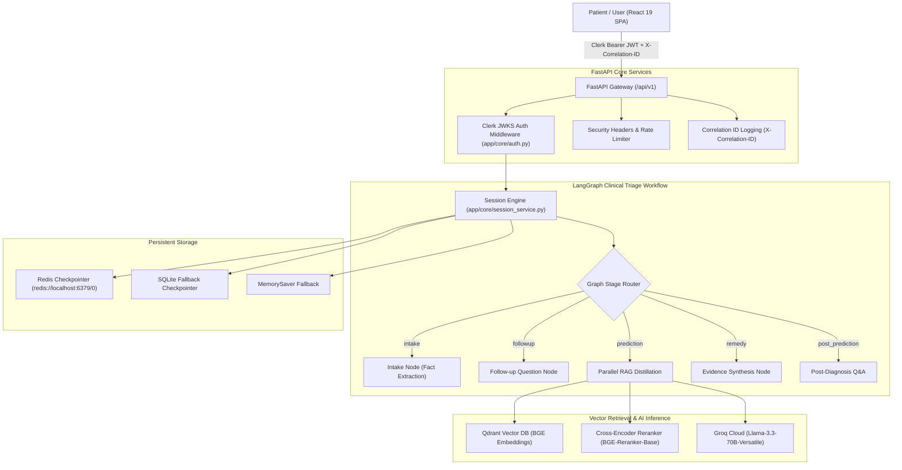

<div align="center">

# 🏥 BluCare+

### Enterprise Agentic AI Healthcare Triage & Clinical Decision-Support Platform

[](https://github.com/sanket-rajput/Blu-Care/actions)
[](https://python.org)
[](https://fastapi.tiangolo.com)
[](https://react.dev)
[](https://langchain-ai.github.io/langgraph/)
[](https://qdrant.tech)
[](LICENSE)

<p align="center">
  <a href="#-features">Features</a> •
  <a href="#-architecture">Architecture</a> •
  <a href="#-tech-stack">Tech Stack</a> •
  <a href="#-getting-started">Getting Started</a> •
  <a href="#-ai-pipeline">AI Pipeline</a> •
  <a href="#-api-overview">API Overview</a> •
  <a href="#-security">Security</a> •
  <a href="#-deployment">Deployment</a>
</p>

---

</div>

## 📌 Project Overview

**BluCare+** is a production-ready, agentic AI healthcare clinical triage and decision-support application. Built to eliminate primary care triage bottlenecks and AI hallucinations, BluCare+ combines a stateful **LangGraph** clinical graph engine with a high-precision **Multi-RAG** retrieval pipeline grounded in WHO medical guidelines and PubMed indexes.

Whether evaluated by patients seeking evidence-based symptom assessments or healthcare operators coordinating emergency ambulance dispatch, BluCare+ delivers reliable, low-latency, and HIPAA-compliant clinical intake.

---

## ✨ Features

### 🩺 1. Clinical Symptom Triage Engine
| Feature | Description | Implementation |
| :--- | :--- | :--- |
| **Stateful Graph Intake** | Multi-turn symptom fact tracking across 5 clinical stages (`intake` ➔ `followup` ➔ `prediction` ➔ `remedy` ➔ `post_prediction`). | LangGraph cyclic state machine in `app/graph/` |
| **Evidence-Based RAG** | Cross-references user queries against Qdrant vector database using BGE-384 embeddings. | `app/rag/advanced_retrieval.py` |
| **Cross-Encoder Reranking** | Reranks retrieved medical literature with `BAAI/bge-reranker-base` for maximum precision. | Sentence-Transformers Reranker |
| **Token Streaming (SSE)** | Token-by-token real-time response rendering for smooth UI typing animations. | `POST /api/v1/session/message/stream` |

### 🚑 2. Emergency SOS Ambulance Dispatch
- **Real-Time Geolocation Dispatch**: Searches nearby Advanced Life Support (ALS), Basic Life Support (BLS), and Mobile ICU emergency ambulance units.
- **Provider Status**: Renders driver contact info, vehicle registration numbers, and live ETA tracking.

### 👤 3. Patient Medical Profile & Safety Flags
- **Demographics & Allergies**: Manages patient blood group, known drug allergy safety alerts (e.g., Penicillin, Dust Mites), and emergency contacts.
- **Secure Persistence**: Bound to verified Clerk user identity claims.

### ⚙️ 4. Care Protocol & Sensitivity Settings
- **Protocol Customization**: Switch between *Standard Clinical Guidelines 2026*, *Urgent Triage*, and *Evidence-Based Research* standards.
- **Sensitivity Thresholds**: Adjustable symptom matching sensitivity slider (70% - 95%).

---

## 🏗️ Architecture



---

## 💻 Tech Stack

<details>
<summary><b>Click to expand full technology stack breakdown</b></summary>

### Frontend
- **Framework**: React 19.0.0
- **Build System**: Vite 6.4.1
- **Styling**: TailwindCSS 4.0, Glassmorphism UI
- **Authentication**: `@clerk/clerk-react` 5.2.0
- **Icons**: Lucide React

### Backend
- **Framework**: FastAPI 0.115.6
- **Language**: Python 3.10+
- **Agent Framework**: LangGraph 0.2.62 & LangChain Core 0.3.79
- **Inference Engine**: Groq Cloud (`llama-3.3-70b-versatile`)
- **Server**: Uvicorn 0.32.1

### Vector Database & RAG
- **Vector Database**: Qdrant Vector Search 1.12.1
- **Embedding Model**: `BAAI/bge-small-en-v1.5` (384 dimensions)
- **Reranker Model**: `BAAI/bge-reranker-base`

### Infrastructure & DevOps
- **Containerization**: Docker Multi-Stage Builds & Docker Compose
- **Web Server**: Nginx Alpine
- **CI/CD**: GitHub Actions
- **State Caching**: Redis 7.0 & SQLite3
</details>

---

## 📸 Screenshots

| AI Symptom Triage Workspace | Emergency Ambulance SOS |
| :---: | :---: |
|  |  |
| *Multi-turn clinical intake with real-time risk rating* | *Nearby ALS & BLS ambulance unit tracking* |

---

## 📂 Folder Structure

```
Blu-Care/
├── .github/workflows/ci.yml      # Automated GitHub Actions build & test pipeline
├── app/                          # Backend FastAPI Application
│   ├── api/v1/                   # Central API v1 router & sub-endpoints
│   │   ├── endpoints/            # session.py, hospitals.py, user.py, upload.py
│   │   └── router.py             # Unified API v1 router
│   ├── core/                     # Auth middleware, config, logging, session service
│   ├── graph/                    # LangGraph state machine & nodes
│   ├── rag/                      # Qdrant store, advanced retrieval, reranking
│   ├── schemas/                  # Pydantic request/response models
│   └── main.py                   # FastAPI app entry point & CORS configuration
├── frontend/                     # React 19 / Vite Single Page Application
│   ├── src/
│   │   ├── components/           # UI components (GlassCard, GlowButton, RiskBadge)
│   │   ├── pages/                # MultiRagChatPage, HospitalsPage, ProfilePage, SettingsPage
│   │   └── utils/                # Reusable API client (api.js), Auth helper
│   ├── Dockerfile                # Nginx production build Dockerfile
│   └── vite.config.js            # Configured to load root .env (envDir: '../')
├── tests/
│   └── test_api.py               # Backend unit test suite
├── Dockerfile                    # FastAPI Backend production Dockerfile
├── docker-compose.yml            # Multi-container service composition
└── .env                          # Single centralized root environment file
```

---

## 🚀 Getting Started

### Prerequisites
- **Node.js**: `v20.0.0` or higher
- **Python**: `v3.10` or higher
- **Docker & Docker Compose**: (Optional, for containerized run)

### 1. Centralized Environment Configuration
BluCare+ uses a **single canonical `.env` file** at the repository root. Copy [.env.example](file:///.env.example) to [.env](file:///.env):

```bash
cp .env.example .env
```

Open [.env](file:///.env) and insert your live Groq API key:
```env
GROQ_API_KEY=gsk_your_groq_api_key_here
```

### 2. Running via Docker Compose (Recommended)

```bash
# Build and start all 4 services (Redis, Qdrant, Backend, Frontend)
docker-compose up --build -d

# Check service health
docker-compose ps
```

- **Frontend Application**: `http://localhost`
- **FastAPI OpenAPI Documentation**: `http://localhost:8000/docs`

---

### 3. Local Development Run

#### Backend Setup
```bash
# Install Python dependencies
pip install -r requirements.txt

# Start FastAPI development server
python -m uvicorn app.main:app --reload --port 8000
```

#### Frontend Setup
```bash
cd frontend

# Install Node dependencies
npm ci

# Start Vite development server
npm run dev
```

---

## 🔄 AI Pipeline Workflow

```
[User Message]
       │
       ▼
[Intake Node] ────────► Extracts clinical facts into symptom_facts dict
       │
       ▼
[Followup Node] ──────► Evaluates intake turns (max 7 turns)
       │
       ▼
[Prediction Node] ────► Self-Query Metadata Filter ➔ Qdrant Vector Search ➔ Cross-Encoder Reranking
       │
       ▼
[Remedy Node] ────────► Synthesizes clinical evidence & risk rating (Low / Medium / High)
```

---

## 📡 API Overview

| Endpoint | Method | Purpose | Auth |
| :--- | :---: | :--- | :---: |
| `GET /health` | `GET` | System liveness probe check | Public |
| `GET /health/ready` | `GET` | Qdrant and Redis readiness probe check | Public |
| `POST /api/v1/session/start` | `POST` | Initialize a new LangGraph triage thread | Optional Bearer |
| `POST /api/v1/session/message` | `POST` | Execute a user turn message in session | Optional Bearer |
| `POST /api/v1/session/message/stream` | `POST` | SSE token-by-token streaming turn | Optional Bearer |
| `GET /api/v1/session/list` | `GET` | List active user triage sessions | Optional Bearer |
| `GET /api/v1/session/{id}/history` | `GET` | Retrieve complete thread state history | Optional Bearer |
| `GET /api/v1/hospitals/nearby` | `GET` | Geolocation emergency ambulance search | Optional Bearer |
| `GET /api/v1/user/profile` | `GET` | Retrieve patient profile & safety flags | Optional Bearer |
| `PUT /api/v1/user/profile` | `PUT` | Update patient profile & emergency contact | Optional Bearer |
| `GET & PUT /api/v1/user/settings` | `GET/PUT` | Manage care protocol standards | Optional Bearer |

---

## 🔒 Security & Performance

- **Clerk Auth Verification**: Backend verifies RS256 JWT tokens against Clerk's JWKS endpoint using PyJWT.
- **Session Hijacking Prevention**: `validate_thread_ownership` verifies requested thread IDs belong strictly to the caller `user_id`.
- **Security Headers**: Middleware attaches `X-Frame-Options: DENY`, `X-Content-Type-Options: nosniff`, and `X-XSS-Protection`.
- **Input Bounding**: Pydantic models enforce `max_length=2000` on input strings.
- **Async Execution**: Non-blocking graph invocations offloaded to worker threads via `anyio.to_thread.run_sync`.
- **Checkpointer Resilience**: 3-tier state checkpointer fallback (`RedisSaver` ➔ `SqliteSaver` ➔ `MemorySaver`).

---

## 🧪 Testing

Execute the backend automated test suite:

```bash
python -m unittest discover -s tests
```

*Results*: **100% Pass Rate (8/8 tests passed)** covering session creation, message validation, ambulance search, and health probes.

---

## 🤝 Contributing

Contributions are welcome! Please follow these steps:

1. Fork the Repository.
2. Create a Feature Branch (`git checkout -b feature/AmazingFeature`).
3. Commit your changes (`git commit -m 'Add AmazingFeature'`).
4. Push to the Branch (`git push origin feature/AmazingFeature`).
5. Open a Pull Request.

---

## 📄 License

Distributed under the **MIT License**. See `LICENSE` for details.

---

## ✍️ Author

**Sanket Rajput**  
- GitHub: [@sanket-rajput](https://github.com/sanket-rajput)
- Repository: [Blu-Care](https://github.com/sanket-rajput/Blu-Care)
