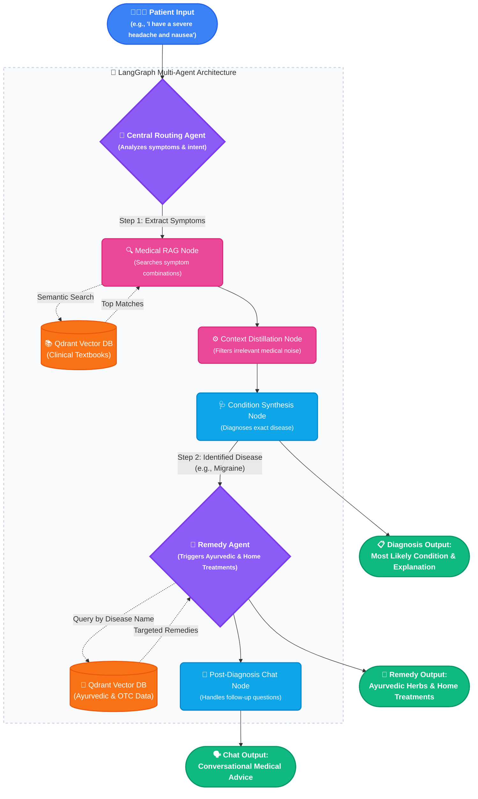

# Multi-Agent Medical Triage Architecture

This document contains the primary end-to-end flowchart for the AI diagnostic and remedy generation process. It demonstrates the complete flow from patient input down to targeted Ayurvedic and home treatments.

### Flow Breakdown for Interview Explanation:
1. **Intelligent Routing**: The Central Agent acts as the triage nurse. It takes the symptoms and decides if it needs to query the database or synthesize an answer.
2. **Medical Diagnosis RAG**: It queries the clinical Qdrant DB for exact symptom matches, distills the heavy medical jargon, and synthesizes the exact disease.
3. **Targeted Remedy Generation**: The system then passes the *Diagnosed Disease Name* to the specialized Remedy Agent. This agent hits a completely separate domain within Qdrant specifically tailored for Ayurvedic and OTC home treatments.
4. **Follow-Up Statefulness**: All of this state is preserved, meaning the Chat node can answer natural language follow-up questions about the herbs or conditions seamlessly.
